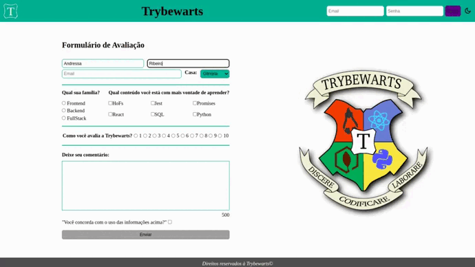

# Trybewarts

## Boas-vindas ao repositório do projeto TrybeWarts-Formulário !

Página de formulário da Escola de Magia de Trybewarts, em que as pessoas estudantes poderão enviar seus feedbacks sobre ela. O tema desse projeto é baseado na obra 'Harry Potter', de J. K. Rowling. Nesta versão foi adicionado o modo dark vs light para melhor visibilidade. 
O projeto foi criado enquanto estudante de Desenvolvimento web Trybe, durante o módulo de Fundamentos Web como quisito obrigatório para aprovação.

## Demonstração

## 🚀Tecnologias e Ferramentas utilizadas:

<h1 align='left'>

</h1>
